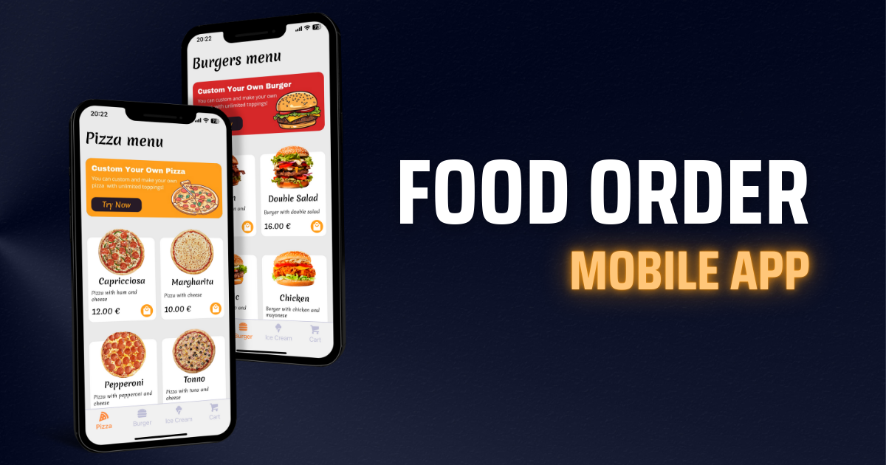
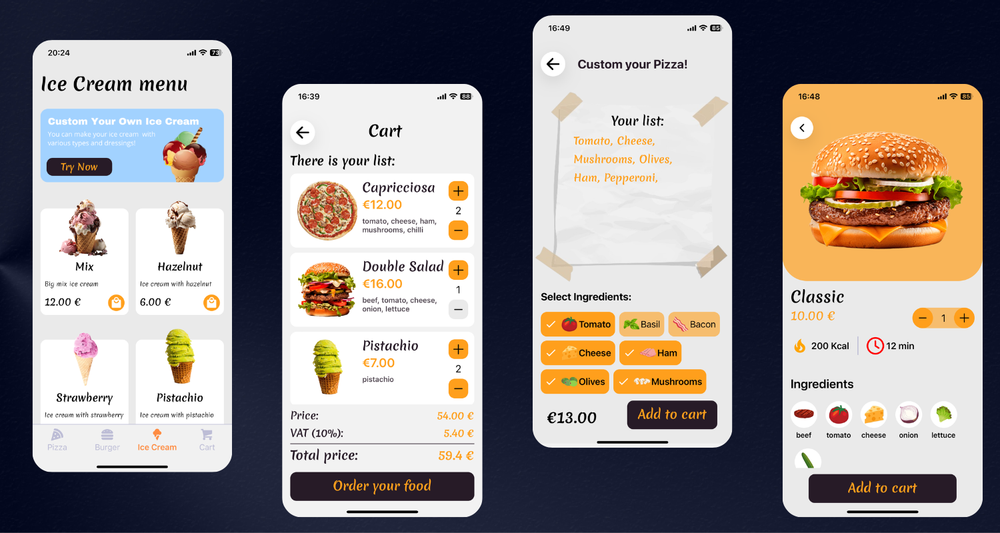

<h3 align="center">Food Order Mobile App</h3>

## 🛠️ Tech Stack

## 📖 About

This application is designed for a restaurant setting, allowing customers to place orders directly from their table. Users can enter their table number and then proceed to order from a selection of products. The app includes three main types of products, with the added feature of customization for each product type. Customers can create their own custom meals by selecting and adding their preferred ingredients. Once the order is complete, it is sent directly to the kitchen for preparation.

This application is still in development. Future plans include creating an admin panel for the kitchen side to manage and process incoming orders efficiently.

## 🖼️ Images

